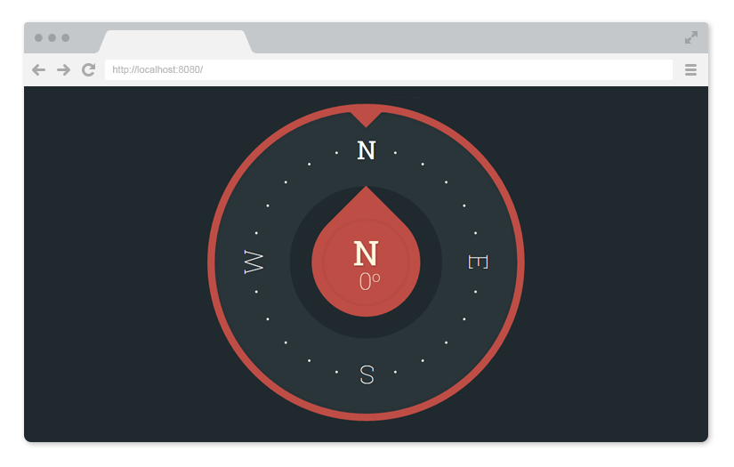

# React Compass v0.1.0

[](https://badge.fury.io/js/react-compass) [](http://badge.fury.io/bo/react-compass) [](https://david-dm.org/virtyaluk/react-compass) [](https://david-dm.org/virtyaluk/react-compass#info=devDependencies) [](https://david-dm.org/virtyaluk/react-compass#info=peerDependencies)

> A carefully crafted Compass component for React. ([Demo](http://modern-dev.com/projects/react-compass/))

<p align="center">
  
</p>


## Installation

The package can be installed via:

- Bower: `bower install react-compass`
- NPM: `npm install react-compass --save`

You’ll need to install React separately since this dependency isn’t included in the package. Below is a simple example on how to use the FashionCompass in a React view. You will also need to require the css file from this package (or provide your own). The example below shows how to include the css from this package if your build system supports requiring css files (webpack is one that does).

```js
import React from 'react';
import { render } from 'react-dom';
import Compass from 'react-Compass';
import 'react-compass/dist/react-compass.css';

class MyApp extends React.Component {
    // ...
    render() {
        return (
            <Compass direction={this.state.newDirection} />
        );
    }
}

render(<MyApp />, document.getElementById('app'));
```

## Configuration

The default Compass can be initialised by:

```js
<Compass direction{0} />
```

You may use [Device Orientation Events](https://developer.mozilla.org/en-US/docs/Web/API/Detecting_device_orientation) to update your compass direction each time the orientation was changed.

Optionally, you may pass array of string containing direction names like next:

```js
<Compass directionNames={['N', 'NE', 'E', 'SE', 'S', 'SW', 'W', 'NW']}>
```

## Compatibility

We're always trying to stay compatible with the latest version of React. We can't support all older versions of React, since React is still < 1.0 and introducing breaking changes every release.

Latest compatible versions:

- React 0.14 or newer: All above ReactCompass v0.1.0

## Local Development

The `master` branch contains the latest version of the Compass component. To start your example app, you can run `npm dev-server`. This starts a `react-dev-server` on `http://localhost:8080`. The server will automatically compile your changes and execute linters.

## The examples

The examples are hosted within the `example` folder and are ran in the simple add that loads the Compass. To extend the examples with a new example, you can simply duplicate one of the existing examples and change the unique properties of your example.

## License

MIT © [Bohdan Shtepan](https://github.com/virtyaluk)